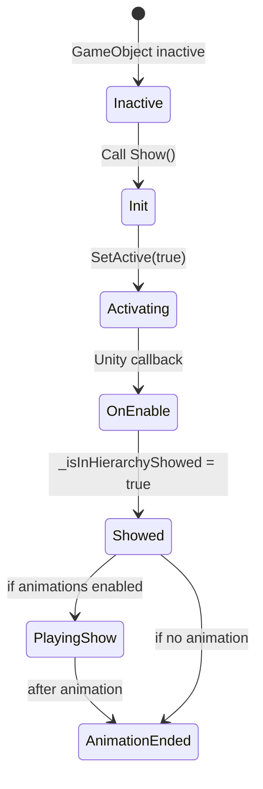
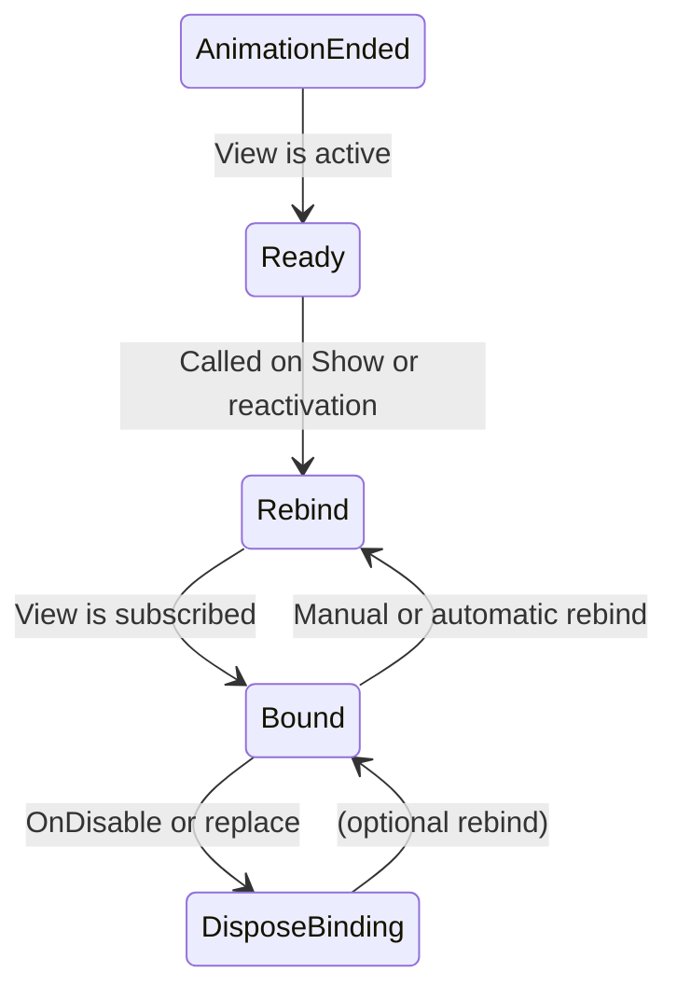
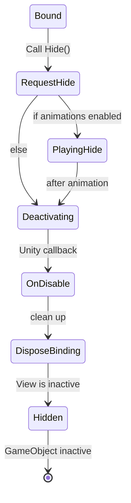

# ReactiveUI for Unity
**ReactiveUI** is a modular UI framework for Unity focused on reactive programming, animation management, and lifecycle control of UI components. It simplifies UI implementation and supports customization while enforcing clean separation of logic and rendering.


## Philosophy
> **UI should listen, not control.**  
> ReactiveUI flips the flow — views react to state, not the other way around.

- **Loose coupling** – Business logic doesn’t talk to UI. Views subscribe to state changes.
- **Plug & swap** – Replace a number with a progress bar? Just bind a different view.
- **Reactive by design** – Views react only when visible. Subscriptions are clean and automatic.
- **Lifecycle & animation built-in** – Show/hide state and transitions are handled out of the box.
- **Modular components** – Buttons, selectors, tab menus, etc. included and extensible.


## Why Reactive?

ReactiveUI uses [R3](https://github.com/neuecc/R3) — a fast, modern reactive library for Unity.  
It simplifies UI logic, reduces boilerplate, and makes complex flows easier to manage.

### Examples

- **One-time reactions**
```csharp
_button.OnClickAsObservable().Take(1).Subscribe(_ => PlayIntro());
```

- **Merge multiple states**
```csharp
CombineLatest(_hp, _shield, (hp, s) => hp + s).Subscribe(UpdateTotalDefense);
```

- **Lifecycle-safe bindings**
```csharp
_health.ValueChanged.Subscribe(UpdateBar).AddTo(this);
```

- **Conditional flows**
```csharp
_player.IsAlive.Where(a => a).Subscribe(_ => ShowHUD());
```

- **Cancel on new input**
```csharp
_searchQuery.SelectMany(q => Fetch(q).TakeUntil(_searchQuery)).Subscribe(Update);
```

> These aren’t the “top 5 features” — just useful patterns that keep your code clean, safe, and reactive.  
> ReactiveUI avoids race conditions by binding to state instead of trying to control it.


## Features
ReactiveUI is built around `UIView` — a base class that handles visibility, animation, and binding lifecycle.

### UIView lifecycle
- **Safe Init** — guaranteed even if the view starts inactive (`activeSelf == false`)
- **Auto cleanup** — subscriptions disposed on hide or rebind
- **Deferred binding** — binds when view becomes visible
- **Built-in hide support** — optional `_btnHide` to close the view

### Animation support
- **Optional and flexible** — supports `Animator`, DOTween (via extension), or custom
- **Auto flow** — `Show()` and `Hide()` handle animation and activation
- **Precise state control** — visibility states (`Showed`, `Hidden`, etc.) exposed

### Ready-made components
- `ViewButton` — reactive click handling
- `ShowViewButton`, `HideViewButton` — control any view
- `Selector` — reactive toggle group
- `TabMenu` — tab-based UI with visibility sync
- `ConfirmationPopUp` — out-of-the-box confirm dialog


## UIView Lifecycle

UIView ensures proper initialization, safe binding, and full animation support.  
The lifecycle is split into three key phases:

---

### 1. Show Phase


**Highlights**
- `Init()` is guaranteed before anything else — even if inactive in scene.
- `Show()` activates the object and triggers animation if defined.
- `_isInHierarchyShowed` reflects true when view is fully active.

---

### 2. Binding Phase


**Highlights**
- `Rebind()` connects logic to data — called on activation or manually.
- `DisposeBinding()` clears all subscriptions — no leaks.
- Views are reactive only while shown.

---

### 3. Hide Phase


**Highlights**
- `Hide()` respects animation, if any.
- `OnDisable()` guarantees cleanup and proper state reset.
- `_isSelfShowed` / `_isInHierarchyShowed` track current state.

---

Together, these phases ensure:
- Views are always initialized before use  
- Bindings are managed automatically  
- Show/Hide transitions are consistent and extendable


## Usage: UIView and Binding

Not every UI element needs to reflect game state.  
For simple panels or static popups, just use `UIView` directly.

But if your view **binds to systems or data**, extend `UIView` and implement a custom `Bind(...)` method.  
There’s no default `Bind()` on `UIView` — because what to bind and how is up to you.

### How to bind safely:
- Accept your target in a `Bind(...)` method.
- Cache it internally.
- Call `RebindIfShowedInHierarchy()` to trigger binding:
  - instantly, if already shown
  - later, once shown

This keeps your subscriptions safe and lifecycle-aware.

Example:
```csharp
public class MyView : UIView
{
    private IDisposable _disposable;
    private PlayerStats _playerStats;

    protected override void InitCore()
    {
        // For example: button.OnClickAsObservable().Subscribe(...).AddTo(this);
        // Use AddTo(this) here only for subscriptions tied to the view itself
    }

    public void Bind(PlayerStats stats)
    {
        _playerStats = stats;
        RebindIfShowedInHierarchy();
    }

    protected override void BindFromCache()
    {
        if (_playerStats == null)
            return;

        _disposable = _playerStats.HP
            .Subscribe(UpdateHPBar);
    }

    protected override void DisposeBinding()
    {
        _hpSubscription?.Dispose();
        _hpSubscription = null;
    }

    protected override void OnShowed()
    {
        // Maybe play sound, open tutorial, etc.
    }

    protected override void OnHided()
    {
        // Maybe reset state or hide overlays
    }
}
```

> 💡 **Why rebind instead of direct binding?**  
> Because `Bind()` might be called while the view is inactive.  
> `UIView` guarantees binding **only when shown**, so you avoid early or broken subscriptions.


## UIView States and Properties

Every `UIView` exposes reactive flags and enums that reflect its visibility and animation state — useful for controlling flow, binding logic, and awaiting transitions.

### Show-related

- `IsSelfShowed`  
  `true` if `Show()` was called — even if the view is currently inactive.

- `IsInHierarchyShowed`  
  `true` if the view is **active in the hierarchy** — i.e., visible in the scene.

- `ShowInHierarchyState` (enum)  
  Tracks show progress:
  - `None` — never shown or already hidden
  - `Requested` — `Show()` was triggered
  - `Showed` — view was activated (`OnEnable` called)
  - `AnimationEnded` — show animation finished (or none exists)

### Hide-related

- `HideInHierarchyState` (enum)  
  Tracks hide progress:
  - `None` — currently shown or not hiding
  - `Requested` — `Hide()` was triggered
  - `Hided` — view is now inactive and hidden

These allow you to:
- Wait for full visibility before starting logic (`ShowInHierarchyState == AnimationEnded`)
- Chain transitions (e.g. wait for one view to close before opening another)
- Reactively bind to visibility changes

> All these are `ReactiveProperty<T>` and can be used with `.Subscribe(...)` to build clean, reactive UI flows.

 
## Animations

ReactiveUI supports optional animations for view transitions — cleanly integrated into the view lifecycle.

### How It Works

If a `UIView` has an assigned `IViewAnimations`, it will:
- Automatically animate on `Show()` / `Hide()`
- Wait for the animation to finish before updating state
- Only deactivate after the hide animation completes

You don’t have to manually trigger or manage animation flow — it’s handled internally.

### Assigning Animations

There are two ways to assign animations:

**1. Attach a MonoBehaviour**

Add a component implementing `IViewAnimations` (like `MonoViewAnimations`) to the same GameObject.  
It will be detected automatically.

**2. Set manually via code**

Assign a custom animation at runtime — ideal for factory-driven or pooled views:
```csharp
view.SetAnimations(new MyCustomFadeAnimation());
```

### Built-in Base Classes

ReactiveUI offers two abstract base classes to help implement `IViewAnimations` safely:

| Class                | Type          | Use When... |
|---------------------|---------------|-------------|
| `ViewAnimations`     | Plain C#      | No MonoBehaviour needed — e.g. pooled or data-driven animations |
| `MonoViewAnimations` | MonoBehaviour | Unity-native workflow using serialized fields or component references |

These base classes provide:
- `Init(UIView view)` — injects the owner view
- `PlayShow()` / `PlayHide()` — entry points for your logic
- `ShowEnded` / `HideEnded` — observables to signal completion
- `Dispose()` — cleanup if needed

They also enforce correct usage: trying to animate before `Init()` throws a dev-friendly error.

### Custom Animations

To create your own animations, inherit from one of the base classes.  
For example, with DOTween and `MonoViewAnimations`:

```csharp
public class ScalePopAnimation : MonoViewAnimations
{
    [SerializeField] private Transform _target;
    [SerializeField] private float _duration = 0.2f;
    [SerializeField] private Vector3 _start = Vector3.zero;
    [SerializeField] private Vector3 _end = Vector3.one;

    protected override void InitCore(UIView view)
    {
        _target.localScale = _start;
    }

    protected override void PlayShowCore()
    {
        _target
            .DOScale(_end, _duration)
            .SetEase(Ease.OutBack)
            .OnComplete(() => _showEnded.OnNext(Unit.Default));
    }

    protected override void PlayHideCore()
    {
        _target
            .DOScale(_start, _duration)
            .SetEase(Ease.InBack)
            .OnComplete(() => _hideEnded.OnNext(Unit.Default));
    }
}
```

> ✅ Ensure `ShowEnded` and `HideEnded` fire once per call.  
> Kill old tweens before starting new ones to avoid overlaps.

### Built-in Implementations

#### Animator-based

The `AnimatorViewAnimations` component uses Unity’s Animator system.  
To detect animation completion, place animation events and call:

- `ObservableViewAnimatorTrigger.OnAnimationShowEnded()`
- `ObservableViewAnimatorTrigger.OnAnimationCloseEnded()`

This provides a simple way to use native clips for fades, slides, or scale transitions.

#### DoTween Extension

An official add-on supports rich procedural animation using DoTween:  
👉 [reactive-ui-dotween (GitHub)](https://github.com/CliffCalist/reactive-ui-dotween)

It includes:
- Preset animations (fade, scale, slide, popup)
- Safe tween disposal and cancellation
- Full control over timing and sequencing


## Tools
1. **ViewVisibilityTracker** — tracks `Show`/`Hide` state of a group of views.

## Built-in UI Elements
1. **ViewButton** — simple reactive-style button component.  
2. **ShowViewButton** — button to trigger `Show()` on a view.  
3. **HideViewButton** — button to trigger `Hide()` on a view.  
4. **Selector / SelectorOption** — toggle-based selector component.  
5. **TabMenu / TabButton** — tab-based menu for switching between views.  
6. **ConfirmationPopUp** — ready-to-use confirmation dialog window.
